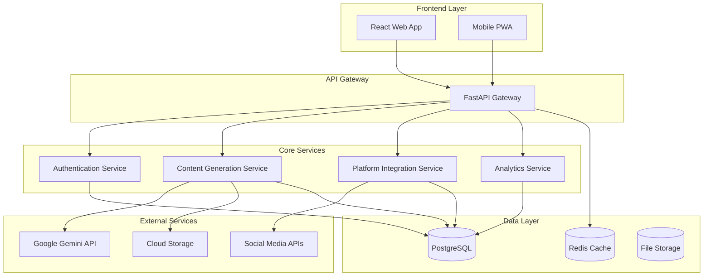

# Design Document

## Overview

The Artisan Promotion Platform is a web-based application that streamlines product promotion for local artisans across multiple social media and marketplace platforms. The system uses a modern microservices architecture with AI-powered content generation, automated posting capabilities, and comprehensive analytics dashboard.

## Architecture

### High-Level Architecture



### Technology Stack

- **Frontend**: React.js with TypeScript, Tailwind CSS
- **Backend**: Python with FastAPI
- **Database**: PostgreSQL for relational data, Redis for caching
- **File Storage**: AWS S3, Google Cloud Storage, or Cloudflare R2 (leveraging generous free tiers for cost-effective image storage)
- **Image Processing**: Pillow (PIL) for compression and optimization
- **AI Integration**: Google Gemini API for content generation
- **Browser Automation**: Playwright for platforms without APIs
- **Authentication**: JWT with refresh tokens
- **API Framework**: FastAPI with Pydantic for data validation
- **Deployment**: Docker containers with orchestration

## Components and Interfaces

### 1. Authentication Service

**Responsibilities:**
- User registration and login
- JWT token management
- Password security and validation
- Session management

**Key Interfaces:**
```python
from pydantic import BaseModel
from typing import Optional

class UserRegistration(BaseModel):
    email: str
    password: str
    business_name: str
    business_type: str

class AuthResult(BaseModel):
    success: bool
    user_id: Optional[str]
    access_token: Optional[str]
    refresh_token: Optional[str]

class AuthService:
    async def register(self, user_data: UserRegistration) -> AuthResult:
        pass
    
    async def login(self, email: str, password: str) -> AuthResult:
        pass
    
    async def refresh_token(self, token: str) -> AuthResult:
        pass
    
    async def validate_token(self, token: str) -> dict:
        pass
```

### 2. Content Generation Service

**Responsibilities:**
- Image processing and compression
- AI-powered content generation via Gemini API
- Content formatting for different platforms
- Content preview and editing

**Key Interfaces:**
```python
from typing import List
from fastapi import UploadFile

class ContentInput(BaseModel):
    description: str
    business_context: dict
    target_platforms: List[str]

class GeneratedContent(BaseModel):
    title: str
    description: str
    hashtags: List[str]
    variations: List[dict]

class ProcessedImage(BaseModel):
    original_url: str
    compressed_url: str
    thumbnail_url: str
    file_size: int
    dimensions: dict

class ContentService:
    async def process_images(self, images: List[UploadFile]) -> List[ProcessedImage]:
        pass
    
    async def generate_content(self, input_data: ContentInput) -> GeneratedContent:
        pass
    
    async def format_for_platform(self, content: GeneratedContent, platform: str) -> dict:
        pass
```

### 3. Platform Integration Service

**Responsibilities:**
- OAuth authentication with social platforms (API-based)
- Browser session management for automation-based platforms
- Platform-specific API integrations and browser automation
- Post scheduling and publishing across both integration types
- Error handling and retry logic for both approaches

**Key Interfaces:**
```python
from datetime import datetime
from enum import Enum

class Platform(str, Enum):
    FACEBOOK = "facebook"
    INSTAGRAM = "instagram"
    FACEBOOK_MARKETPLACE = "facebook_marketplace"
    ETSY = "etsy"
    PINTEREST = "pinterest"
    MEESHO = "meesho"
    SNAPDEAL = "snapdeal"
    INDIAMART = "indiamart"
    SHOPIFY = "shopify"

class IntegrationType(str, Enum):
    API = "api"
    BROWSER_AUTOMATION = "browser_automation"
    HYBRID = "hybrid"

class PostResult(BaseModel):
    platform: Platform
    success: bool
    post_id: Optional[str]
    error: Optional[str]
    published_at: Optional[datetime]
    integration_method: IntegrationType

class PlatformConnection(BaseModel):
    platform: Platform
    integration_type: IntegrationType
    access_token: Optional[str]
    refresh_token: Optional[str]
    session_active: Optional[bool]
    is_active: bool
    connected_at: datetime

class HybridPlatformService:
    async def connect_platform(self, platform: Platform, user_id: str, auth_data: dict = None) -> PlatformConnection:
        pass
    
    async def post_content(self, content: dict, platforms: List[Platform], user_id: str) -> List[PostResult]:
        pass
    
    async def schedule_post(self, content: dict, schedule: datetime, user_id: str) -> dict:
        pass
    
    async def get_platform_metrics(self, platform: Platform, date_range: dict, user_id: str) -> dict:
        pass
    
    async def verify_connections(self, user_id: str) -> List[PlatformConnection]:
        pass
```

#### Platform Integration Strategy

**API-First Approach with Browser Automation Fallback:**

**Tier 1: API Integration** (Preferred - Full automation with official APIs)
- **Facebook**: Graph API with OAuth 2.0 for posts and pages
- **Instagram**: Graph API (via Facebook) for business accounts
- **Facebook Marketplace**: Graph API for marketplace listings
- **Etsy**: REST API with OAuth 1.0a for shop listings
- **Shopify**: Admin API with OAuth 2.0 for store integration
- **Pinterest**: Business API with OAuth 2.0 (requires approval)

**Tier 2: Browser Automation** (Fallback for platforms without public APIs)
- **Meesho**: No public API, browser automation for seller dashboard
- **Snapdeal**: Limited API access, browser automation for product listings
- **IndiaMART**: No posting API, browser automation for product catalog
- **Local marketplace sites**: Often no APIs, automation required
- **Emerging platforms**: Browser automation for quick integration

**Security Model:**
- **API Platforms**: OAuth tokens stored encrypted, automatic refresh handling
- **Browser Automation**: Session-based authentication, no credential storage
- **User Control**: Users can disconnect platforms anytime from dashboard

**User Experience:**
1. **Connect Platform** → User logs in manually (for automation) or OAuth flow (for APIs) → Connection saved securely
2. **Auto-posting** → Uses saved tokens/sessions → Re-authentication prompt if expired
3. **Session Management** → Users can view and disconnect platforms anytime

### 4. Analytics Service

**Responsibilities:**
- Data aggregation from multiple platforms
- Sales tracking and reporting
- Engagement metrics calculation
- Dashboard data preparation

**Key Interfaces:**
```python
from decimal import Decimal

class SaleEvent(BaseModel):
    product_id: Optional[str]
    platform: Platform
    amount: Decimal
    currency: str
    order_id: str
    occurred_at: datetime

class DashboardData(BaseModel):
    total_revenue: Decimal
    total_orders: int
    engagement_metrics: dict
    top_products: List[dict]
    platform_breakdown: dict

class AnalyticsService:
    async def aggregate_metrics(self, user_id: str, date_range: dict) -> DashboardData:
        pass
    
    async def track_sale(self, sale_data: SaleEvent) -> None:
        pass
    
    async def get_top_products(self, user_id: str, limit: int) -> List[dict]:
        pass
    
    async def get_platform_breakdown(self, user_id: str, date_range: dict) -> dict:
        pass
```

## Data Models

### Core Entities

```python
from sqlalchemy import Column, String, DateTime, Boolean, Integer, Text, DECIMAL, JSON
from sqlalchemy.ext.declarative import declarative_base
from sqlalchemy.sql import func

Base = declarative_base()

class User(Base):
    __tablename__ = "users"
    
    id = Column(String, primary_key=True)
    email = Column(String, unique=True, nullable=False)
    password_hash = Column(String, nullable=False)
    business_name = Column(String, nullable=False)
    business_type = Column(String, nullable=False)
    business_description = Column(Text)
    website = Column(String)
    location = Column(String)
    created_at = Column(DateTime, default=func.now())
    updated_at = Column(DateTime, default=func.now(), onupdate=func.now())

class Product(Base):
    __tablename__ = "products"
    
    id = Column(String, primary_key=True)
    user_id = Column(String, nullable=False)
    title = Column(String, nullable=False)
    description = Column(Text, nullable=False)
    generated_content = Column(JSON)
    created_at = Column(DateTime, default=func.now())
    updated_at = Column(DateTime, default=func.now(), onupdate=func.now())

class ProductImage(Base):
    __tablename__ = "product_images"
    
    id = Column(String, primary_key=True)
    product_id = Column(String, nullable=False)
    original_url = Column(String, nullable=False)
    compressed_url = Column(String, nullable=False)
    thumbnail_url = Column(String, nullable=False)
    file_size = Column(Integer, nullable=False)
    dimensions = Column(JSON, nullable=False)

class PlatformConnection(Base):
    __tablename__ = "platform_connections"
    
    id = Column(String, primary_key=True)
    user_id = Column(String, nullable=False)
    platform = Column(String, nullable=False)
    access_token = Column(String, nullable=False)
    refresh_token = Column(String)
    is_active = Column(Boolean, default=True)
    connected_at = Column(DateTime, default=func.now())
    expires_at = Column(DateTime)

class Post(Base):
    __tablename__ = "posts"
    
    id = Column(String, primary_key=True)
    user_id = Column(String, nullable=False)
    product_id = Column(String, nullable=False)
    platforms = Column(JSON, nullable=False)  # List of platform names
    content = Column(JSON, nullable=False)
    status = Column(String, nullable=False)
    scheduled_at = Column(DateTime)
    published_at = Column(DateTime)
    results = Column(JSON)  # List of PostResult objects

class SaleEvent(Base):
    __tablename__ = "sale_events"
    
    id = Column(String, primary_key=True)
    user_id = Column(String, nullable=False)
    product_id = Column(String)
    platform = Column(String, nullable=False)
    amount = Column(DECIMAL(10, 2), nullable=False)
    currency = Column(String, nullable=False)
    order_id = Column(String, nullable=False)
    occurred_at = Column(DateTime, nullable=False)
```

### Enums and Types

```python
from enum import Enum

class Platform(str, Enum):
    FACEBOOK = "facebook"
    INSTAGRAM = "instagram"
    FACEBOOK_MARKETPLACE = "facebook_marketplace"
    ETSY = "etsy"
    PINTEREST = "pinterest"
    MEESHO = "meesho"
    SNAPDEAL = "snapdeal"
    INDIAMART = "indiamart"
    SHOPIFY = "shopify"

class PostStatus(str, Enum):
    DRAFT = "draft"
    SCHEDULED = "scheduled"
    PUBLISHING = "publishing"
    PUBLISHED = "published"
    FAILED = "failed"
```

### Cloud Storage with Free Tier Benefits

**Purpose**: Cloud storage with generous free tiers for cost-effective startup:

**Free Tier Options**:
- **AWS S3**: 5GB free storage, 20,000 GET requests, 2,000 PUT requests per month
- **Google Cloud Storage**: 5GB free storage per month
- **Cloudflare R2**: 10GB free storage, 1 million Class A operations per month
- **Backblaze B2**: 10GB free storage, 1GB free download per day

**Storage Structure**:
1. **Original Images**: Store uploaded product photos in their original format
2. **Compressed Images**: Store optimized versions for web display and platform posting
3. **Thumbnails**: Store small preview images for dashboard and gallery views
4. **Backup**: Built-in redundancy and versioning

**Benefits**:
- **Cost-Effective**: Free tiers cover initial usage, pay-as-you-grow pricing
- **Scalability**: Handle growing image storage needs without server limitations
- **Performance**: CDN integration for fast image delivery worldwide
- **Reliability**: Built-in redundancy and backup capabilities
- **Security**: Encrypted storage with access controls
- **Global Reach**: Edge locations for fast access worldwide


## Error Handling

### Error Categories

1. **Validation Errors**: Input validation failures, file format issues
2. **Authentication Errors**: Invalid credentials, expired tokens
3. **External API Errors**: Gemini API failures, platform API issues
4. **System Errors**: Database connectivity, file storage issues

### Error Handling Strategy

```typescript
class AppError extends Error {
  constructor(
    public message: string,
    public statusCode: number,
    public code: string,
    public isOperational: boolean = true
  ) {
    super(message)
  }
}

// Global error handler middleware
const errorHandler = (error: Error, req: Request, res: Response, next: NextFunction) => {
  if (error instanceof AppError) {
    return res.status(error.statusCode).json({
      success: false,
      error: {
        code: error.code,
        message: error.message
      }
    })
  }
  
  // Log unexpected errors
  logger.error('Unexpected error:', error)
  
  return res.status(500).json({
    success: false,
    error: {
      code: 'INTERNAL_ERROR',
      message: 'An unexpected error occurred'
    }
  })
}
```

### Retry Logic

- **Gemini API**: Exponential backoff with 3 retries
- **Platform APIs**: Platform-specific retry strategies
- **File Operations**: Immediate retry with fallback storage

## Testing Strategy

### Unit Testing
- **Coverage Target**: 80% minimum
- **Framework**: Jest with TypeScript
- **Focus Areas**: Business logic, data transformations, utility functions

### Integration Testing
- **API Endpoints**: Supertest for HTTP testing
- **Database Operations**: Test database with cleanup
- **External Services**: Mock integrations with contract testing

### End-to-End Testing
- **Framework**: Playwright for web UI testing
- **Scenarios**: Complete user workflows from registration to posting
- **Data**: Isolated test environment with seed data

### Performance Testing
- **Load Testing**: Artillery.js for API load testing
- **Image Processing**: Benchmark compression algorithms
- **Database**: Query performance monitoring

### Security Testing
- **Authentication**: Token validation and expiration
- **Authorization**: Role-based access control
- **Input Validation**: SQL injection and XSS prevention
- **File Upload**: Malicious file detection

## Deployment Architecture

### Container Strategy
```dockerfile
# Multi-stage build for optimized production images
FROM node:18-alpine AS builder
WORKDIR /app
COPY package*.json ./
RUN npm ci --only=production

FROM node:18-alpine AS runtime
WORKDIR /app
COPY --from=builder /app/node_modules ./node_modules
COPY . .
EXPOSE 3000
CMD ["npm", "start"]
```

### Environment Configuration
- **Development**: Local Docker Compose setup
- **Staging**: Kubernetes cluster with external services
- **Production**: Auto-scaling Kubernetes with monitoring

### Monitoring and Observability
- **Logging**: Structured logging with Winston
- **Metrics**: Prometheus with Grafana dashboards
- **Tracing**: OpenTelemetry for distributed tracing
- **Health Checks**: Kubernetes liveness and readiness probes